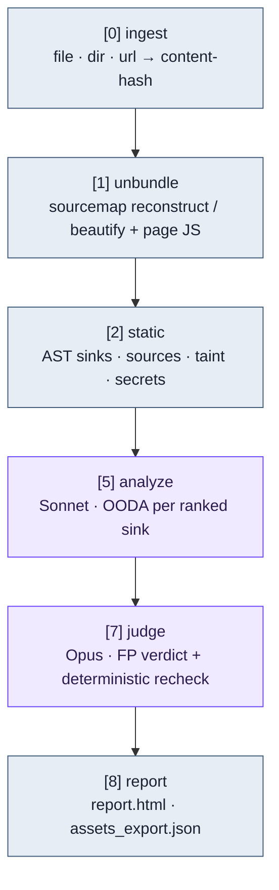

# JS Analyzer Agent

## Pages
https://eunhokim98.github.io/JS-Analyzer-Agent/

Multi-agent JavaScript vulnerability analyzer. See [`DESIGN.md`](./DESIGN.md) for the full architecture.

This repo is at **milestone v0.1**: deterministic static pre-pass → LLM OODA analysis → FP judge → HTML/JSON report, CLI only.

## Concept

Deterministic static analysis narrows the search; LLM agents reason only about the
ranked candidates. This is cheaper and more precise than a pure-LLM scan, and more
context-aware than pure static analysis.

- **Static pre-pass** — Babel AST finds sinks/sources/sanitizers and heuristic taint
  ranks the risky spots. No LLM, runs anywhere.
- **Agentic analysis** — Sonnet runs one OODA round (Observe → Orient → Decide → Act)
  per ranked sink, focusing on candidates instead of the whole codebase.
- **FP judge** — Opus re-reviews each finding and a deterministic recheck
  cross-validates, so only high-confidence findings survive.
- **Data-driven rules** — vulnerability classes are `rules/*.yaml` cards; adding a
  class means adding a card, not changing code.

## Pipeline (v0.1)



**Legend** — steel = deterministic (no API key, runs anywhere); violet = LLM agent
(needs API key). The taint model is `source → sanitizer? → sink`: user input reaching
a dangerous sink without sanitization is a candidate finding.

Numbers `3 · 4 · 6` are reserved for later milestones (explore/asset/chaining agents,
active PoC verification, Burp extension, Claude Code wrapper) — specified in
`DESIGN.md` but not yet built.

## Install

```bash
git clone https://github.com/EunhoKim98/JS-Analyzer-Agent.git
cd JS-Analyzer-Agent
npm install
npm run build
```

## Usage

```bash
# deterministic static analysis only — no API calls, runs anywhere
npx tsx src/cli.ts analyze samples/vulnerable.js --no-llm

# full pipeline (static + LLM analysis + FP judge) — needs credentials (see Auth)
npx tsx src/cli.ts analyze samples/vulnerable.js

# choose the LLM backend (D4): sdk (default) | claude-cli | codex
node dist/cli.js analyze samples/vulnerable.js --provider claude-cli

# or via the built binary
node dist/cli.js analyze <file|dir|.js-url> [--no-llm] [--provider p] [--max-sinks K] [--config path] [--out dir]

# local HTTP job API (what the Burp extension talks to) — with SSE live streaming
node dist/cli.js serve --port 8787
# POST /jobs · GET /jobs/:id · GET /jobs/:id/events (SSE) · GET /jobs/:id/live (web UI) · GET /jobs/:id/report
```

## Acquisition (where the JS comes from)

**Automated browser crawling is not used (D7).** JS comes only from:

- **Files / directories / a direct `.js` URL** (fetched raw) via the CLI.
- **Burp extension** — the JS the tester actually browsed, pulled from Burp proxy
  history/sitemap and sent to the core as a seed. No automated crawling; analysis is
  scoped to real user interaction.

The core binary is fully self-contained — no browser install needed.

## Auth

The LLM stages accept **either** an API key **or** a Claude subscription OAuth token.
Resolution order (first match wins):

1. `ANTHROPIC_API_KEY` — Anthropic API key (pay-per-use).
2. `CLAUDE_CODE_OAUTH_TOKEN` or `ANTHROPIC_AUTH_TOKEN` — Claude Pro/Max OAuth token.
3. `~/.claude/.credentials.json` — auto-detected after `claude login` (Windows/Linux).

```powershell
# API key
$env:ANTHROPIC_API_KEY="sk-ant-..."
# or OAuth token (e.g. from `claude setup-token`)
$env:CLAUDE_CODE_OAUTH_TOKEN="sk-ant-oat01-..."
```

OAuth support is best-effort: it sends the `anthropic-beta: oauth-2025-04-20` header
(override with `ANTHROPIC_OAUTH_BETA`) and a Claude Code identity system block. If the
API rejects the token, fall back to an API key. macOS Keychain-stored credentials are
not auto-read — export a token instead.

Output lands in `runs/<run_id>/` — `sinks.json`, `asset_manifest.json`,
`findings.jsonl`, `verdicts.json`, `assets_export.json`, `report.html`, plus
per-agent `trace/` logs.

## Config

`js-analyzer.config.json` (models, `maxSinks` budget, concurrency, temperature).
Model IDs default to `claude-sonnet-5` (analyze) and `claude-opus-4-8` (judge);
override there if your account uses different IDs.

## Coverage

Vulnerability classes are data-driven rule cards in `rules/*.yaml` (DESIGN.md §15).
v0.1 seeds: DOM-XSS, open redirect, postMessage (missing origin check),
prototype pollution (heuristic), and hardcoded secrets (with public-key
classification). Add a class = add a rule card.
