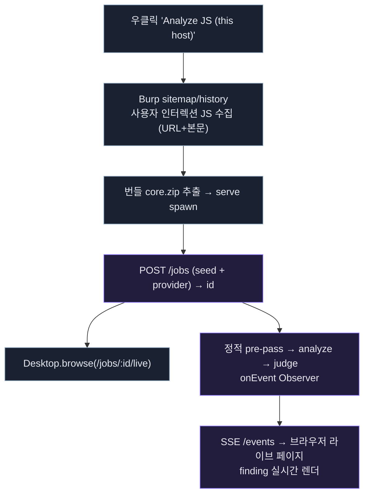

# Burp 확장
{: .no_toc }

버프에 **JAR 하나만 설치**하면, 대상을 고르는 순간 **사용자가 실제 브라우징한** Burp history의 JS를
시드로 가져와 진단하고, 결과가 코어의 **라이브 웹 페이지**에 SSE로 실시간 흘러내립니다. (v1.0, 진행 중)
{: .fs-5 .fw-300 }

1. TOC
{:toc}

---

## 아키텍처 — 얇은 JAR + 번들 코어

버프 확장은 분석 로직을 담지 않습니다. Java(Montoya) 확장은 **얇은 UI**이고, 실제 분석은 JAR에
번들된 Node 코어 바이너리를 `serve` 모드로 띄워 **로컬 HTTP**로 위임합니다. 결과 렌더는 브라우저가
담당하므로 확장의 Swing 렌더 부담이 없습니다.

## 데이터 흐름

1. 버프에서 요청 우클릭 → **"Analyze JS (this host)"**.
2. 확장이 sitemap에서 그 호스트의 JS(URL+응답 본문)를 시드로 수집 — **사용자가 방문한 트래픽만**(자동 크롤링 없음).
3. 번들 코어를 추출·기동하고 `POST /jobs`로 seed와 provider를 제출 → job_id.
4. 확장이 `/jobs/:id/live` 를 브라우저에 연다.
5. 코어: seed 중복제거 → 정적 pre-pass → LLM analyze → judge (Playwright 없음).
6. 각 finding·verdict가 완료되는 대로 **SSE로 흘러** 브라우저 라이브 페이지에 실시간 렌더.

## 중복 경로 전처리

Burp history는 같은 JS URL이 여러 요청에 반복 등장하고, 다른 URL에 동일 본문(CDN 미러/버전 URL)도
흔합니다. 코어는 시드를 파이프라인에 넣기 전에 **content-hash 기준으로 중복을 접습니다** — 같은 본문이면
URL이 달라도 1개. 이름이 겹치는데 내용이 다르면 이름을 disambiguate 합니다.

> 실측: 시드 5개(본문 동일 4개 포함) → **2개 파일**로 축약.

## 로컬 HTTP 잡 API

확장이 호출하는 코어 엔드포인트 (무의존, Node 내장 http · 127.0.0.1 바인딩 + 선택적 토큰):

| 메서드 · 경로 | 응답 |
|---|---|
| `POST /jobs` | `202 { id }` (target·provider·seedFiles JSON) |
| `GET /jobs/:id` | 상태 + meta(counts) |
| `GET /jobs/:id/events` | **SSE 스트림** (`stage`·`finding`·`verdict`·`done`) |
| `GET /jobs/:id/live` | **라이브 웹 UI** (EventSource로 실시간 렌더) |
| `GET /jobs/:id/report` | 최종 `report.html` |
| `GET /health` | `{ ok: true }` |

## 설치

버전별 JAR은 GitHub Releases에서 받습니다 (OS별: linux-x64 / macos-arm64 / windows-x64).
Burp → Extensions → Add → 다운로드한 JAR 선택. Suite 탭 **"JS Analyzer"**에서 provider(SDK URL·토큰 /
Claude Code / Codex)를 설정합니다.

> **Playwright 없음** — 코어 바이너리는 완전 자기완결이라 chromium 설치가 필요 없습니다. 대신 분석 범위는
> **사용자가 실제로 브라우징한 트래픽**(Burp history)으로 한정됩니다. 방문하지 않은 페이지의 JS는 잡히지
> 않으므로, 넓게 훑으려면 대상 앱을 충분히 브라우징한 뒤 분석하세요.
