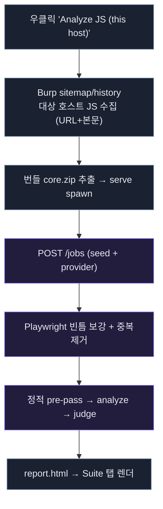

# Burp 확장
{: .no_toc }

버프에 **JAR 하나만 설치**하면, 대상을 고르는 순간 Burp history의 JS를 시드로 가져오고, 빈틈은
Playwright로 채워 진단합니다. (v1.0 마일스톤, 진행 중)
{: .fs-5 .fw-300 }

1. TOC
{:toc}

---

## 아키텍처 — 얇은 JAR + 번들 코어

버프 확장은 분석 로직을 담지 않습니다. Java(Montoya) 확장은 **얇은 UI**이고, 실제 분석은 JAR에
번들된 Node 코어 바이너리를 `serve` 모드로 띄워 **로컬 HTTP**로 위임합니다.

## 데이터 흐름

1. 버프에서 요청 우클릭 → **"Analyze JS (this host)"**.
2. 확장이 sitemap에서 그 호스트의 JS(URL+응답 본문)를 시드로 수집.
3. 번들 코어를 추출·기동하고 `POST /jobs`로 seed와 provider 설정을 제출.
4. 코어가 Playwright로 빈틈(동적 주입·미방문 스크립트)을 보강.
5. 정적 pre-pass → LLM analyze → judge → 리포트.
6. 확장이 폴링으로 완료를 감지해 `report.html`을 Suite 탭에 렌더.

## 중복 경로 전처리

Burp history는 같은 JS URL이 여러 요청에 반복 등장하고, 다른 URL에 동일 본문(CDN 미러/버전 URL)도
흔합니다. 코어는 시드를 파이프라인에 넣기 전에 **content-hash 기준으로 중복을 접습니다** — 같은 본문이면
URL이 달라도 1개. 이름이 겹치는데 내용이 다르면 이름을 disambiguate 합니다.

> 실측: 시드 5개(본문 동일 4개 포함) → **2개 파일**로 축약.

## 로컬 HTTP 잡 API

확장이 호출하는 코어 엔드포인트 (무의존, Node 내장 http · 127.0.0.1 바인딩 + 선택적 토큰):

| 메서드 · 경로 | 응답 |
|---|---|
| `POST /jobs` | `202 { id }` (target·provider·seedFiles JSON) |
| `GET /jobs/:id` | 상태 + meta(counts) |
| `GET /jobs/:id/report` | `report.html` |
| `GET /health` | `{ ok: true }` |

## 설치

버전별 JAR은 GitHub Releases에서 받습니다 (OS별: linux-x64 / macos-arm64 / windows-x64).
Burp → Extensions → Add → 다운로드한 JAR 선택. Suite 탭 **"JS Analyzer"**에서 provider(SDK URL·토큰 /
Claude Code / Codex)를 설정합니다.

> Playwright 브라우저(chromium)는 바이너리에 담기지 않습니다. 페이지 gap-fill 수집을 쓰려면 대상 PC에
> chromium 설치가 필요하며, Burp history 시드만으로도 진단은 동작합니다.
