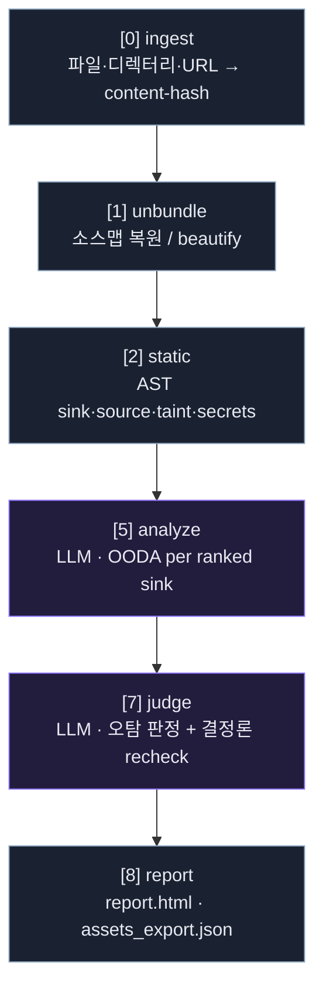

# 파이프라인
{: .no_toc }

수집에서 리포트까지. 번호 `[0][1][2][5][7][8]`은 현재 구현된 단계이고, `3·4·6`은 다음 마일스톤 자리입니다.
{: .fs-5 .fw-300 }

1. TOC
{:toc}

---

## 단계 다이어그램

**범례** — steel = 결정론적(API 키 없이 어디서든), violet = LLM 에이전트(자격증명 필요).

## 단계별 설명

| # | 단계 | 종류 | 하는 일 |
|---|---|---|---|
| 0 | **ingest** | 결정론 | 파일·디렉터리·직접 `.js` URL, 또는 Burp 확장이 넘긴 JS 시드를 입력받아 content-hash로 정규화·중복제거. 인제스트된 소스만 다루며 자동 크롤링은 하지 않는다. |
| 1 | **unbundle** | 결정론 | 소스맵(외부/inline)이 있으면 원본 복원, 없으면 beautify. 인제스트된 소스만 대상으로 한다. |
| 2 | **static** | 결정론 | Babel AST로 sink·source·sanitizer 탐지 + 휴리스틱 테인트 + 에셋·시크릿 수집. LLM 없이 sink 순위화. |
| 5 | **analyze** | LLM (Sonnet 기본) | 순위가 매겨진 sink마다 한 번의 OODA 라운드로 도달 가능성·악용 경로 추론. |
| 7 | **judge** | LLM (Opus 기본) | 오탐 판정 + 결정론적 recheck 교차 검증. 확신 있는 finding만 통과. |
| 8 | **report** | 결정론 | `report.html` + `assets_export.json` 생성. `runs/<run_id>/`에 sinks·findings·verdicts·trace 저장. |

> LLM 단계(5·7)의 백엔드는 **선택 가능**합니다 — [Provider 선택]({{ '/providers.html' | relative_url }}) 참고.

## OODA (단계 5)

`Observe → Orient → Decide → Act` 를 순위가 매겨진 sink마다 반복. 정적 패스가 찾아둔 후보 슬라이스에 대해서만
추론하므로 코드 전체를 LLM에 넣지 않습니다.

## 테인트 모델

`source → sanitizer? → sink`. 사용자 입력이 효과적 새니타이저 없이 위험한 sink에 도달하면 후보 finding입니다.
미니파이 번들에서는 대부분 `sink_only`로 축소되므로, **소스 존재 여부**가 클래스 심각도보다 강한 신호입니다.
랭킹 순서: `has-source → path grade → severity`.

## 자산 추출 (동시 산출)

정적 패스는 취약점과 별개로 소스에 등장하는 경로·엔드포인트·파라미터·시크릿을 함께 뽑아 `assets_export.json`으로
남깁니다. Burp history 등에서 온 중복 경로는 content-hash 기준 [전처리 중복제거]({{ '/burp.html' | relative_url }})로 접습니다.

| 종류 | 예 |
|---|---|
| API/엔드포인트 | `https?://...`, `/api`·`/vN`·`/graphql` 로 시작하는 경로 |
| 경로 | 따옴표로 감싼 `/`로 시작하는 절대경로 |
| 파라미터 | URL 쿼리스트링의 `key=` |
| 시크릿 | `rules/secret.yaml` 정규식 카드 (AWS/Stripe 등, 공개키 분류) |
